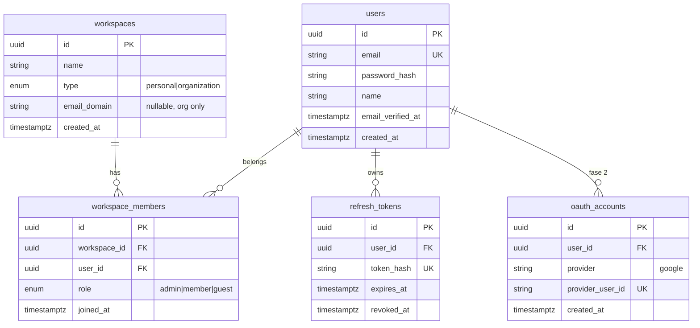

# Auth y multitenancy (estilo Asana)

> **Editable por ti.** Spec principal de autenticación. Implementación: **Passport + JWT desde cero**. Google OAuth en fase posterior.

## Objetivo

Sistema multi-tenant donde el **workspace es el tenant**: todo dato de negocio (teams, projects, tasks) vive dentro de un workspace. Un **usuario global** puede pertenecer a **varios workspaces** con roles distintos en cada uno.

Modelo inspirado en Asana:

| Concepto Asana | Nuestro equivalente |
|----------------|---------------------|
| User (cuenta global) | `users` |
| Workspace | `workspaces` — tenant + aislamiento de datos |
| Organization | `workspaces` con `type = organization` + dominio de email |
| Workspace membership | `workspace_members` |
| Guest (email externo) | `workspace_role = guest` |
| Member | `workspace_role = member` |
| Admin del workspace | `workspace_role = admin` |

## Principios

1. **Usuario ≠ tenant.** El login identifica al usuario; el **workspace activo** delimita qué datos ve y modifica.
2. **Aislamiento estricto.** Toda query de negocio filtra por `workspace_id`. Nunca confiar solo en IDs de URL.
3. **Auth propio en MVP.** Email + password con Passport Local + JWT. Sin OAuth hasta fase 2.
4. **Tokens desde día 1:** access token (corto) + refresh token (largo, rotable).
5. **Google login después.** Dejar hooks (`oauth_accounts`) sin implementar el flujo completo en MVP.

---

## Modelo de datos (auth)



### Reglas de negocio

- **Registro abierto:** cualquier email válido puede registrarse (sin invitación).
- **Sin verificación de email en MVP:** `email_verified_at` queda `null`. Recuperación de contraseña vía **Resend**.
- **Registro:** crea `user` + primer `workspace` personal (`"{name}'s workspace"`) + `workspace_member` como `admin`.
- **Invitar usuario (fase 2):** añade fila en `workspace_members`; sin email transaccional en MVP.
- **Guest:** email que no coincide con `email_domain` de una organization → rol `guest` (solo ve lo compartido).
- **Organization (fase 2):** al detectar dominio `@empresa.com`, sugerir unirse al workspace org existente.

---

## JWT y Passport

### Stack

| Pieza | Librería |
|-------|----------|
| Framework auth | `@nestjs/passport` + `passport` |
| Local (email/password) | `passport-local` |
| JWT | `passport-jwt` + `@nestjs/jwt` |
| Hash passwords | `bcrypt` |
| Google (fase 2) | `passport-google-oauth20` |

### Payload del access token

```typescript
interface JwtAccessPayload {
  sub: string;       // user.id
  email: string;
  type: 'access';
}
```

**No incluir `workspace_id` en el JWT** (el usuario cambia de workspace sin re-login). El tenant activo va en header.

### Workspace activo (tenant context)

Header obligatorio en rutas de negocio:

```
X-Workspace-Id: <uuid>
```

Guard `WorkspaceMemberGuard`:
1. Usuario autenticado (JWT válido)
2. Header `X-Workspace-Id` presente
3. Existe `workspace_members` para `(user_id, workspace_id)`
4. Adjuntar a `request`: `{ user, workspace, membership }`

### Refresh token — cookie httpOnly (decisión cerrada)

| | **httpOnly cookie** ✅ | **body JSON** |
|---|------------------------|---------------|
| XSS | JS no puede leer el refresh | Si lo guardas en localStorage, un script malicioso lo roba |
| CSRF | Mitigar con `SameSite=Lax/Strict` + POST only en `/refresh` | Menos riesgo CSRF en refresh |
| CORS | Requiere `credentials: true` + origin allowlist | Más simple |
| Mobile futuro | Añadir header `Authorization: Refresh …` o body en fase 2 | Natural para apps nativas |

**Elegimos httpOnly cookie** para la web (nuestro cliente MVP):

- **Access token:** solo en **memoria** del cliente (variable JS, no localStorage)
- **Refresh token:** cookie `httpOnly; Secure; SameSite=Lax; Path=/api/v1/auth`
- Login/register/refresh: API setea la cookie; el body devuelve `{ accessToken, user, workspaces }` **sin** refresh en JSON
- Logout: API revoca en DB y limpia la cookie
- Frontend: `fetch(..., { credentials: 'include' })` en todas las llamadas al API

Si más adelante hay cliente mobile, `/auth/refresh` puede aceptar **también** refresh en body (dual mode); no hace falta en MVP.

### TTL sugerido

- Access: **15 minutos**
- Refresh: **7 días**, rotación en cada uso

---

## API — Fase 1 (MVP)

Prefijo: `/api/v1/auth`

| Método | Ruta | Auth | Descripción |
|--------|------|------|-------------|
| POST | `/register` | — | email, password, name → user + workspace personal |
| POST | `/login` | Local | email, password → `{ accessToken, user }` + cookie refresh |
| POST | `/refresh` | Cookie | cookie refresh → nuevo access + cookie refresh rotada |
| POST | `/logout` | JWT | revoca refresh + borra cookie |
| GET | `/me` | JWT | perfil del usuario + lista de workspaces |
| POST | `/forgot-password` | — | email → token de reset (1 h). En dev devuelve `resetUrl` |
| POST | `/reset-password` | — | token + password → nueva contraseña, revoca refresh tokens |

Prefijo: `/api/v1/workspaces`

| Método | Ruta | Auth | Descripción |
|--------|------|------|-------------|
| GET | `/` | JWT | workspaces del usuario |
| POST | `/` | JWT | crear workspace adicional |
| GET | `/:id` | JWT + member | detalle (requiere membership) |

### Recuperación de contraseña

1. Usuario en `/forgot-password` → `POST /auth/forgot-password`
2. API genera token UUID (hash SHA-256 en `password_reset_tokens`, TTL **1 hora**)
3. API genera token UUID (hash SHA-256 en `password_reset_tokens`, TTL **1 hora**)
4. **Email:** `PasswordResetNotificationService` envía enlace vía **Resend**
5. **Dev sin Resend:** enlace en respuesta `resetUrl` + log en consola del API
6. Usuario abre `/reset-password?token=...` → `POST /auth/reset-password`
7. Se actualiza `password_hash`, se invalida el token y **todos los refresh tokens** del usuario

Variables:

| Variable | Descripción |
|----------|-------------|
| `RESEND_API_KEY` | API key de Resend |
| `RESEND_FROM_EMAIL` | Remitente (`no-reply@junno.online`) |
| `RESEND_FROM_NAME` | Nombre visible del remitente |
| `WEB_APP_URL` | Base URL web para el enlace de reset |
| `APP_NAME` | Nombre en plantillas de email |

---

## Estructura del módulo `auth` (NestJS)

```
apps/api/src/modules/auth/
├── auth.module.ts
├── auth.controller.ts
├── auth.service.ts
├── strategies/
│   ├── local.strategy.ts          # email + password
│   ├── jwt-access.strategy.ts     # Bearer access token
│   └── jwt-refresh.strategy.ts    # refresh en body
├── guards/
│   ├── local-auth.guard.ts
│   └── jwt-auth.guard.ts
├── entities/
│   ├── user.entity.ts
│   └── refresh-token.entity.ts
├── dto/
│   ├── register.dto.ts
│   ├── login.dto.ts
│   └── auth-response.dto.ts
├── interfaces/
│   └── jwt-payload.interface.ts
└── auth.service.spec.ts

apps/api/src/modules/workspaces/
├── workspaces.module.ts
├── workspaces.controller.ts
├── workspaces.service.ts
├── guards/
│   └── workspace-member.guard.ts   # tenant guard
├── entities/
│   ├── workspace.entity.ts
│   └── workspace-member.entity.ts
└── ...
```

### Dependencias entre módulos

- `AuthModule` exporta `JwtAuthGuard`, `AuthService`
- `WorkspacesModule` exporta `WorkspaceMemberGuard`
- Módulos de negocio (`projects`, `tasks`) importan ambos guards

---

## Fase 2 — Google OAuth (planificado, no MVP)

### Flujo

1. `GET /auth/google` → redirect a Google
2. `GET /auth/google/callback` → Passport GoogleStrategy
3. Si `oauth_accounts` existe → login
4. Si email ya existe en `users` → vincular cuenta
5. Si no existe → crear user + oauth_account (+ workspace personal)
6. Emitir mismo par JWT que login local

### Preparación en MVP

- Crear entidad `oauth_accounts` vacía en migración (opcional)
- No registrar `GoogleStrategy` hasta fase 2
- Variables de entorno reservadas: `GOOGLE_CLIENT_ID`, `GOOGLE_CLIENT_SECRET`, `GOOGLE_CALLBACK_URL`

---

## Seguridad

- Password: bcrypt, cost factor **12**
- Rate limit en `/login` y `/register` (fase 1.1 o middleware)
- Refresh token: UUID v4 + hash SHA-256 en DB
- Revocar todos los refresh tokens al cambiar password
- CORS: credentials si usamos cookie para refresh
- Validar email único case-insensitive (`citext` en PostgreSQL recomendado)

---

## Frontend (implicaciones)

1. Tras login/register: guardar `accessToken` **solo en memoria** (React state / módulo singleton)
2. Refresh: cookie httpOnly — el browser la envía solo; **no** leer ni guardar refresh en JS
3. Todas las peticiones: `credentials: 'include'` + `Authorization: Bearer <access>`
4. Guardar `activeWorkspaceId` en localStorage tras elegir workspace
5. Interceptor: header `X-Workspace-Id` en rutas de negocio
6. En 401: una llamada a `POST /auth/refresh` (con cookie); si falla → login
7. Pantalla **workspace switcher** si el usuario tiene >1 workspace

---

## Orden de implementación (agentes)

0. [ ] `cp .env.example .env` + `pnpm docker:up` (Postgres + Redis)
1. [ ] Entidades: `users`, `workspaces`, `workspace_members`, `refresh_tokens`
2. [ ] Migraciones MikroORM
3. [ ] `AuthModule`: register, login, refresh, logout, me
4. [ ] Passport Local + JWT strategies
5. [ ] `WorkspacesModule`: list, create
6. [ ] `WorkspaceMemberGuard` + decorator `@CurrentWorkspace()`
7. [ ] Tests: register, login, refresh rotation, tenant isolation
8. [ ] Contratos en `packages/contracts/auth.types.ts`
9. [ ] UI web: login, register, workspace picker
10. [ ] (Fase 2) Google OAuth + `oauth_accounts`

---

## Decisiones cerradas

| Decisión | Valor |
|----------|-------|
| Auth library | Passport + JWT (custom, no Auth0/Clerk) |
| Tenant key | `workspace_id` + header `X-Workspace-Id` |
| Password hash | bcrypt |
| Token pair | access + refresh desde MVP |
| Refresh delivery | **httpOnly cookie** (web); access en memoria |
| Email verification | **No** en MVP (sin proveedor de correo) |
| Registro | **Abierto** (sin invitaciones) |
| Workspace personal | Nombre auto: `"{name}'s workspace"` |
| Google OAuth | Fase 2, no MVP |

## Decisiones pendientes

_(ninguna crítica para empezar auth)_
