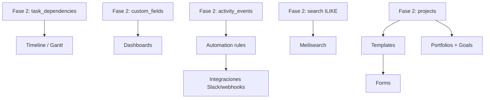

# Advanced (Fase 3) — Plan de entrega

> **Editable.** Prioriza con el equipo antes de implementar.  
> Producto: `docs/PRODUCT.md`. Arquitectura: `docs/ARCHITECTURE.md`.

**Prerrequisitos:** Fase 2 cerrada (`docs/CORE-PHASE2.md`).

## Objetivo

Capacidades de planificación avanzada, automatización e integraciones — sin romper el núcleo entregado en Fase 2.

## Mapa de dependencias

## Orden recomendado

| # | Épica | Prioridad | Duración est. | Por qué este orden |
|---|-------|-----------|---------------|-------------------|
| 1 | **Timeline / Gantt** | Alta | 2 sprints | Aprovecha `task_dependencies`, `start_at`/`due_at`; alto valor visual |
| 2 | **Meilisearch** | Media | 0,5 sprint | Sustituye ILIKE; Docker profile `search` ya previsto |
| 3 | **Automation rules** | Alta | 2 sprints | BullMQ + Redis; reutiliza `activity_events` como triggers |
| 4 | **Templates de proyecto** | Media | 1 sprint | Acelera onboarding; sections + custom fields copiables |
| 5 | **Portfolios + Goals** | Media | 2 sprints | Capa sobre projects existentes |
| 6 | **Dashboards** | Media-baja | 1,5 sprints | Agregaciones sobre tasks/custom fields |
| 7 | **Forms** | Baja | 1,5 sprints | Entrada externa → task; depende de templates |
| 8 | **Integraciones** | Baja | 2+ sprints | Slack, webhooks salientes; después de rules |

---

## Épica 1 — Timeline / Gantt

**Estado:** ✅ v1 entregada (jun 2026)

**DoD v1:** vista Timeline en proyecto; barras por rango de fechas; dependencias visibles; drag cambia fechas (editor+).

| Capa | Entregable | Estado |
|------|------------|--------|
| API | `dependencies[]` en `GET /projects/:id/tasks` | ✅ |
| UI | Tab `Timeline`; 28 días; flechas entre tasks | ✅ |
| Realtime | Mismos eventos `task.changed` | ✅ |

**Pendiente v1.1:** escala mes, tareas sin fecha en lane inferior, critical path.

**Fuera de scope v1:** baseline, horas estimadas.

---

## Épica 2 — Meilisearch

**Estado:** ✅ v1 entregada (jun 2026)

**DoD:** búsqueda instantánea workspace-wide; índices `tasks`, `projects`, `comments`; fallback ILIKE si Meilisearch no está disponible.

| Capa | Entregable | Estado |
|------|------------|--------|
| Infra | `docker compose --profile search`; `SEARCH_ENGINE=meilisearch` | ✅ |
| API | `GET /workspaces/search` delega a Meilisearch con fallback Postgres | ✅ |
| Sync | Hook en create/update task, comment, project | ✅ |
| Docs | `docs/SEARCH.md` | ✅ |

Ver `docs/SEARCH.md` y `docs/DOCKER.md` (profile `search`).

---

## Épica 3 — Automation rules

**Estado:** ✅ v1 entregada (jun 2026)

**DoD:** reglas por proyecto; trigger → acción; cola BullMQ; UI lista + editor simple.

| Capa | Entregable | Estado |
|------|------------|--------|
| DB | `automation_rules`, `automation_runs` | ✅ |
| Worker | BullMQ consumer en API (`REDIS_URL`) | ✅ |
| API | CRUD `projects/:id/automation-rules` | ✅ |
| Triggers v1 | `task_completed`, `task_assigned`, `task_due_changed` | ✅ |
| Acciones v1 | assign, move section, comment, inbox notify | ✅ |
| UI | Settings proyecto → Reglas | ✅ |

**Pendiente v1.1:** reglas workspace-wide, trigger custom field, job fecha vencida.

Ver `docs/AUTOMATION.md`.

---

## Épica 4 — Templates de proyecto

**Estado:** ✅ v1 entregada (jun 2026)

**DoD:** guardar proyecto como template; crear proyecto desde template (sections, custom fields, tareas opcionales).

| Capa | Entregable | Estado |
|------|------------|--------|
| DB | `project_templates`, sections, custom_fields, tasks | ✅ |
| API | CRUD + `POST .../projects` | ✅ |
| UI | Guardar en settings; selector al crear | ✅ |

Ver `docs/TEMPLATES.md`.

---

## Épica 5 — Portfolios + Goals

**Estado:** ✅ v1 entregada (jun 2026)

**DoD:** agrupar projects en portfolio; goal con métrica (% tasks done, custom field rollup).

Tablas: `portfolios`, `portfolio_projects`, `goals`, `goal_metric_snapshots`. Ver `docs/PORTFOLIOS.md`.

---

## Épica 6 — Dashboards

**Estado:** ✅ v1 entregada (jun 2026)

**DoD:** widgets configurables (tasks by assignee, overdue count, custom field breakdown); 1 dashboard por workspace o team.

Tablas: `dashboards`, `dashboard_widgets`. Ver `docs/DASHBOARDS.md`.

---

## Épica 7 — Forms

**Estado:** ✅ v1 entregada (jun 2026)

**DoD:** form público o interno que crea task en proyecto destino; campos mapeados a custom fields.

Tablas: `project_forms`, `form_fields`. Ver `docs/FORMS.md`.

---

## Épica 8 — Integraciones

**Estado:** ✅ v1 entregada (jun 2026)

**DoD v1:**

- Webhooks salientes (`task.created`, `task.updated`) con firma HMAC opcional
- Slack: incoming webhook o OAuth + canal
- WhatsApp (Kapso): notificación texto vía API proxy Meta
- Cola BullMQ + logs de entrega
- UI en settings de proyecto

Ver `docs/INTEGRATIONS.md`.

---

## Paralelización sugerida

| Stream | Owner | Scope |
|--------|-------|-------|
| **Planificación** | Full-stack | Timeline + dependencias visuales |
| **Plataforma** | Backend | Meilisearch + BullMQ rules |
| **Growth** | Full-stack | Templates → Forms |
| **Enterprise** | Full-stack | Portfolios → Dashboards → Integraciones |

## Criterio de cierre Fase 3 (borrador)

- [ ] Timeline usable en producción para al menos 1 proyecto piloto
- [ ] ≥1 automation rule ejecutándose en background
- [ ] Meilisearch o decisión documentada de posponer
- [ ] ≥2 épicas restantes priorizadas en roadmap Q siguiente

## Fuera de scope Fase 3

- Billing / planes de pago
- Mobile nativo
- Offline-first
- Permisos a nivel workspace más allá de admin/member/guest
